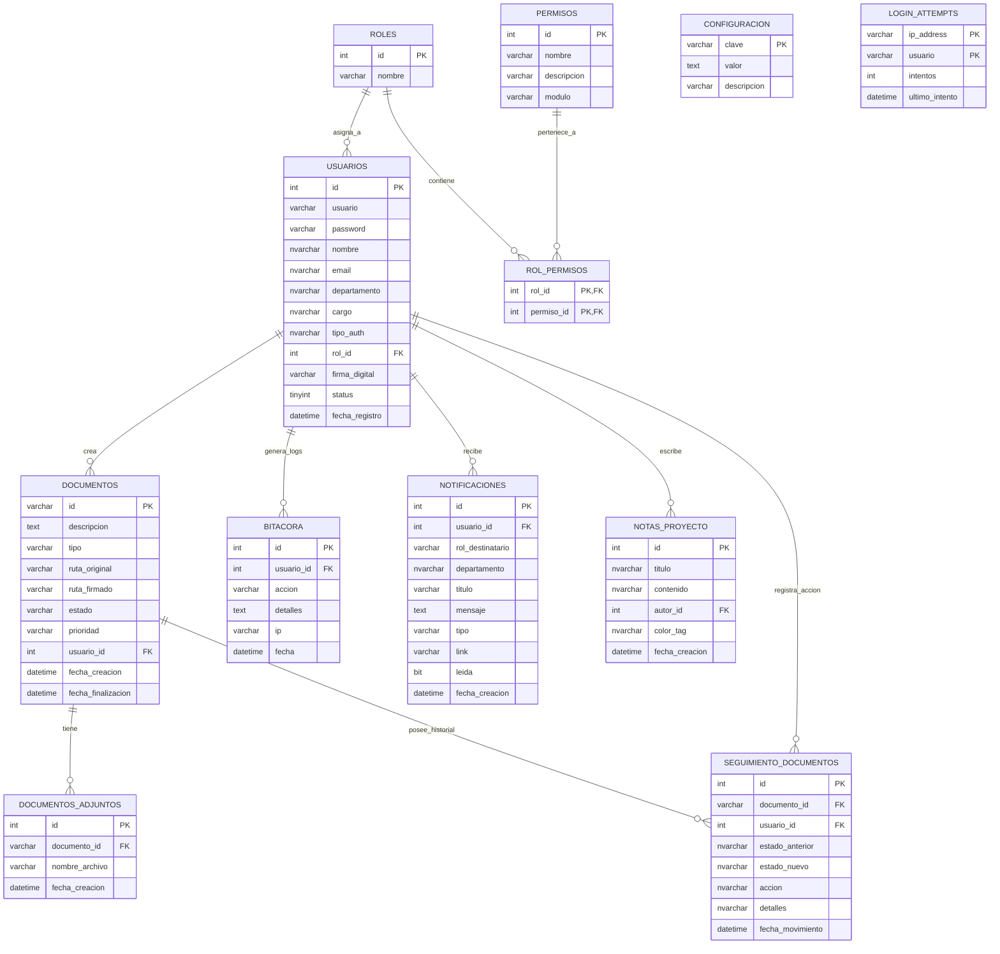

# 📊 Diagrama Entidad-Relación — SIGEDOC

Este diagrama representa la estructura de datos consolidada en `schema_master_sqlserver.sql`.

## Notas del Esquema
1. **Identificadores**: Se utiliza `id` autoincremental en casi todas las tablas, excepto en `DOCUMENTOS` donde el ID es un código institucional (ej. `DOC-2026-001`).
2. **Seguridad**: La tabla `LOGIN_ATTEMPTS` es fundamental para el rate-limiting implementado en la v2.2.6.
3. **Flujo**: `SEGUIMIENTO_DOCUMENTOS` permite auditoría completa del ciclo de vida de un acta.
